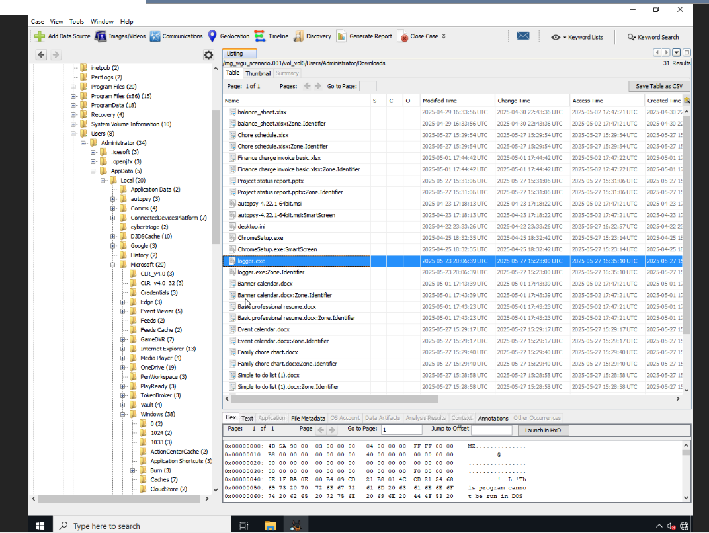
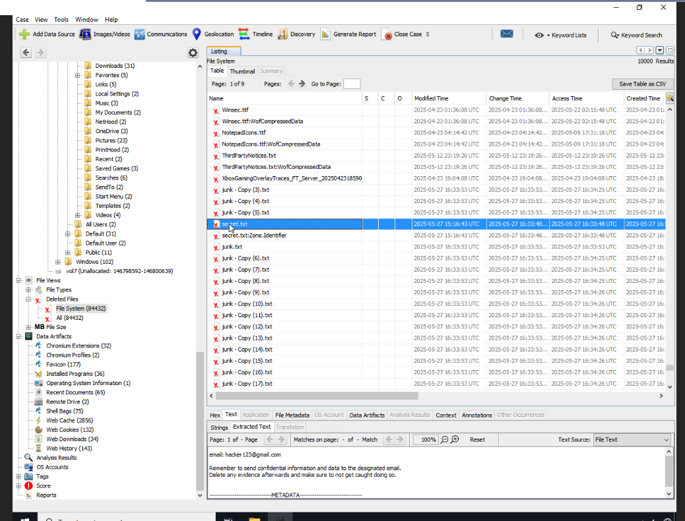
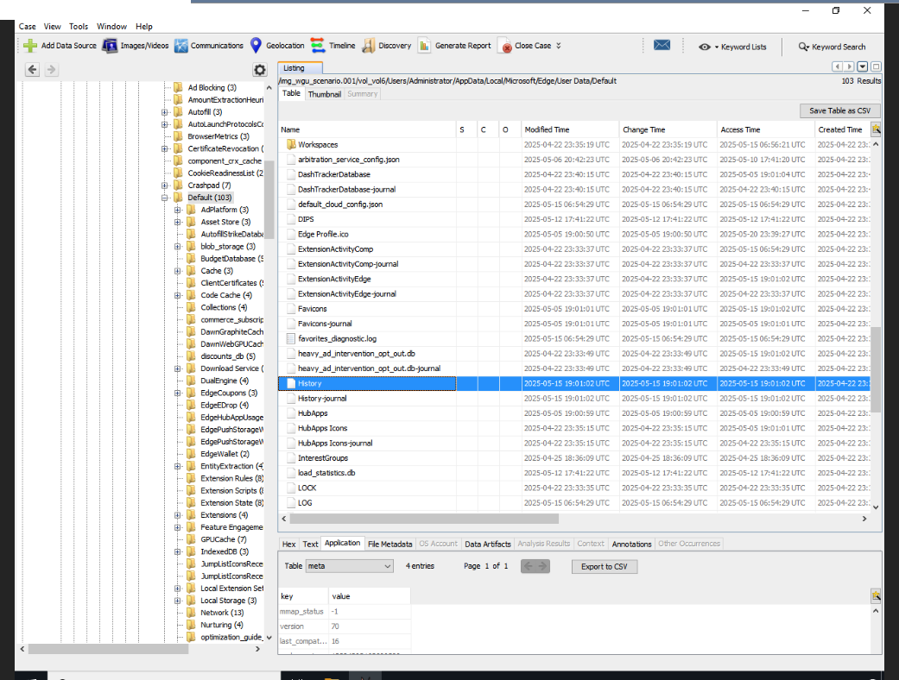

# Digital Forensic Investigation: Suspected Insider Data Theft

**Tools:** Autopsy 4.22  
**Skills:** Forensic case management, Windows artifact analysis, deleted-file recovery, browser forensics, evidence handling, investigative reporting  
**Context:** B.S. Cybersecurity coursework (WGU), rewritten for this portfolio

## Scenario
A company suspected that a Windows 11 workstation had been used to access proprietary data without authorization and possibly send it outside the organization. The user may also have tried to cover their tracks. I examined a forensic image of the workstation to find out what happened and whether company policy was violated.

## Approach
1. **Built the case in Autopsy** and added the forensic disk image as the data source.
2. **Examined the file system manually.** Full ingest modules were disabled to keep the lab VM stable, so I located each artifact by hand, working through event logs, user profile folders, deleted files, browser data, Prefetch, and system logs.
3. **Exported every artifact** to the case's export folder and documented each step with screenshots.
4. **Correlated the artifacts** into a timeline of user activity, then evaluated them against acceptable use and data-handling policies.

The investigation followed standard forensic principles: preserve the original evidence, document every action, and maintain chain of custody.

## Evidence Recovered
| Artifact | Location / File | Why it matters |
|---|---|---|
| Security event log | `Security.evtx` | Logon activity and access attempts; establishes who used the system and when |
| System event log | `System.evtx` | Startup, shutdown, and service activity; anchors the timeline |
| Planning document | `Todo.docx` (user profile) | Shows intent: the user appears to have planned the activity |
| Unauthorized executable | `logger.exe` (user profile) | Unapproved tool; the name suggests keystroke or activity logging |
| **Deleted** text file | `secret.txt` (recovered) | Potentially sensitive data prepared for exfiltration, then deleted, which suggests concealment |
| Edge cookies | `Cookies` database | Session and login data for web services |
| Edge browser history | `History` database | Visits to external webmail and file-sharing services, a possible exfiltration path |
| Edge Prefetch | `MSEDGE.EXE-37025FA8.pf` | Confirms the browser actually ran, corroborating the history and cookies |
| USB / device install log | `setupapi.dev.log` | External devices connected, another possible exfiltration path |
| Thumbnail cache | `thumbcache_32.db` | Evidence of files viewed, including files that no longer exist |

## Findings
The artifacts point to a single story:
- **Planning:** the user documented intent (`Todo.docx`).
- **Unauthorized tooling:** they ran a tool that isn't approved (`logger.exe`).
- **Staging and concealment:** sensitive data was staged in a text file (`secret.txt`), which was then deleted.
- **Two exfiltration paths:** browser artifacts show visits to external webmail and file-sharing services, and device logs show removable media was connected.
- **Corroboration:** Prefetch confirms the browser executed, and the thumbnail cache shows files that were accessed and later removed.

**Conclusion:** The evidence strongly supports violations of the acceptable use and data-handling policies. It does **not** prove the data actually left the organization. Confirming that would require network or proxy logs, mail logs, or a forensic image of the USB device.

## What I Learned
No single artifact proves anything. `secret.txt` alone is just a deleted file. The case comes from corroboration: intent, tooling, staging, deletion, and two exfiltration channels all pointing the same way. I also learned to state clearly what the evidence *doesn't* prove, which matters as much as what it does.
