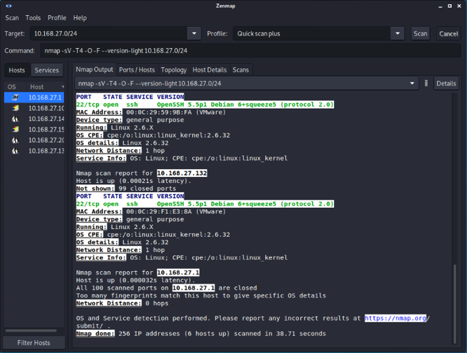
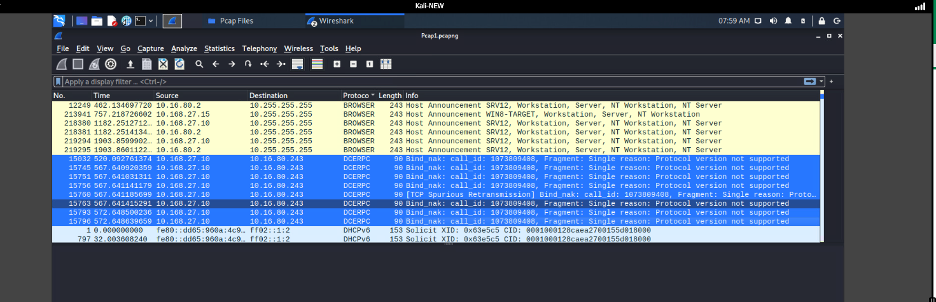
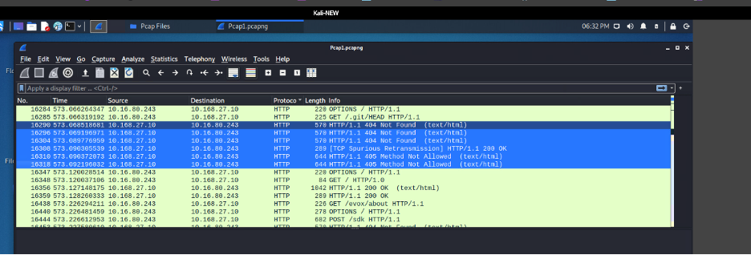
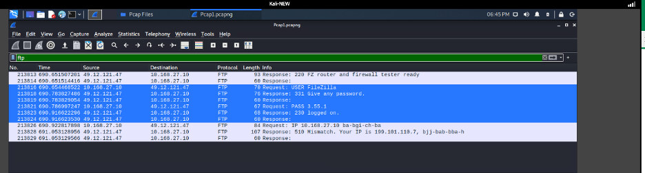

# Network Vulnerability Assessment

**Tools:** Nmap / Zenmap, Wireshark, Kali Linux  
**Skills:** Network reconnaissance, service and OS fingerprinting, vulnerability identification, packet analysis, risk communication  
**Context:** B.S. Cybersecurity coursework (WGU), rewritten for this portfolio

## Scenario
I assessed a small lab network (`10.168.27.0/24`) to map its hosts, identify vulnerable services, and look for suspicious activity in captured traffic, then recommended fixes.

## Approach
1. **Discovery and fingerprinting:** I scanned the full /24 from a Kali Linux host:
   ```
   nmap -sV -T4 -O -F --version-light 10.168.27.0/24
   ```
   - `-sV` detects service versions
   - `-O` fingerprints the operating system
   - `-F` limits the scan to the 100 most common ports for speed
2. **Topology mapping:** I used Zenmap's topology view to identify the network layout.
3. **Vulnerability review:** I compared the discovered OS versions and services against vendor support status and known protocol weaknesses.
4. **Traffic analysis:** I reviewed packet captures in Wireshark for anomalies.



## Findings
The scan found **6 live hosts** in a **star topology**, with all hosts one hop from the scanning machine.

| # | Finding | Risk |
|---|---|---|
| 1 | **End-of-life Windows Server 2012** (`10.168.27.10`, which announces itself on the network as `SRV12`) exposing multiple legacy services | No security patches since October 2023. Known remote-code-execution and denial-of-service vulnerabilities will never be fixed. |
| 2 | **LDAP on 389/TCP with no LDAPS (636/TCP)** | Directory queries and binds may travel in cleartext, exposing Active Directory information to anyone sniffing the network. |
| 3 | **FileZilla FTP server on 21/TCP** | FTP sends credentials and files unencrypted, enabling credential capture, brute-force attempts, and data exposure. |
| 4 | **Outdated Linux hosts** (kernel 2.6.32, OpenSSH 5.5p1 on Debian 6) | Both are years past end of support, with published vulnerabilities. |

### Wireshark anomalies

**A. RPC probing (packets 15032–15796).** `10.16.80.243` sent repeated DCERPC bind requests to `10.168.27.10`, which rejected every one with `Bind_nak` ("protocol version not supported"). Normal clients negotiate RPC once and succeed. Repeated rejected binds from one source look like RPC interface enumeration.



**B. Web enumeration (packets 16284–16318).** The same source, `10.16.80.243`, sent `OPTIONS`, `PROPFIND`, and `GET /.git/HEAD` requests to `10.168.27.10`, followed by requests for `/evox/about` and `POST /sdk`. The server answered mostly with 404 and 405 errors. These are not browsing requests. They check for an exposed Git repository, WebDAV methods, and VMware management endpoints, a pattern typical of automated vulnerability scanners.



**C. Outbound cleartext FTP (packets 213813–213828).** `10.168.27.10` opened an FTP session to an external address, `49.12.121.47`, and sent its username and password in cleartext (`USER FileZilla`, `PASS 3.55.1`, reply `230 Logged on`). The server banner (`FZ router and firewall tester ready`) and the credentials match FileZilla's built-in network configuration test. The final reply, `510 Mismatch. Your IP is 199.101.118.7`, shows the host sits behind NAT. The session itself is likely benign, but it shows the server can make unrestricted outbound cleartext connections to the internet.



### Putting it together
All three anomalies involve **`10.168.27.10`**, the end-of-life Windows Server 2012 from finding #1:
- **Probing:** an internal host, `10.16.80.243`, is actively enumerating it over RPC and HTTP.
- **Outbound traffic:** the server makes cleartext outbound connections to the internet with no apparent egress filtering.

The most vulnerable host on the network is also the one being actively targeted, which makes it the top remediation priority. `10.16.80.243` needs to be identified: either it is an authorized scanner, or it is a compromised or rogue host.

## Recommendations
**Vulnerabilities**
1. **EOL Windows Server:** Upgrade to a supported release, or isolate the host until migration is complete ([Microsoft Lifecycle](https://learn.microsoft.com/en-us/lifecycle/announcements/windows-server-2012-r2-end-of-support)).
2. **LDAP:** Enable LDAPS, or enforce LDAP signing and channel binding ([Microsoft ADV190023](https://msrc.microsoft.com/update-guide/en-us/advisory/ADV190023)).
3. **FTP:** Enable FTPS with TLS or replace FTP with SFTP. Disable unencrypted FTP and restrict access to authorized hosts ([FileZilla Wiki](https://wiki.filezilla-project.org/FTPS_using_Explicit_TLS_howto_(Server))).

**Anomalies**
- **Identify `10.16.80.243`:** Confirm whether it is an authorized vulnerability scanner. If not, isolate it and investigate it as a potentially compromised host.
- **RPC:** Restrict RPC to trusted hosts and alert on repeated `Bind_nak` responses from a single source ([MS-RPCE](https://learn.microsoft.com/en-us/openspecs/windows_protocols/ms-rpce/92ba4942-0b1f-41aa-8924-69dd6e49b546)).
- **Web enumeration:** Add web log monitoring and alerting for scanner patterns such as `/.git/`, `PROPFIND`, and `/sdk` (NIST SP 800-53 SI-4), and consider a WAF to block scanning sources.
- **Egress filtering:** Block outbound FTP from servers and allow only required outbound traffic, so cleartext credentials never leave the network (NIST SP 800-53 SC-7, SC-8).

## What I Learned
My first read of the traffic was wrong. I assumed `10.168.27.10` was making the suspicious requests. Rechecking the source and destination columns showed it was the target, and the real scanner was `10.16.80.243`. Confirming traffic direction before drawing conclusions is a basic step, and in a SOC it decides whether you investigate the victim or the attacker.
